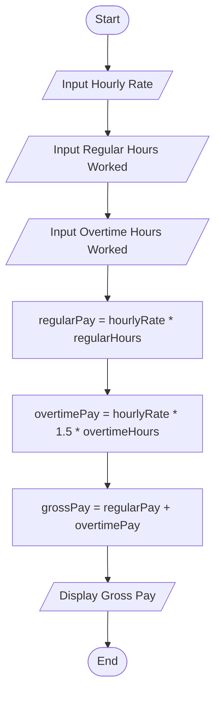

```mermaid
flowchart TD
    A([Start])
    B[/Input Hourly Rate/]
    C[/Input Regular Hours Worked/]
    D[/Input Overtime Hours Worked/]
    E[regularPay = hourlyRate * regularHours]
    F[overtimePay = hourlyRate * 1.5 * overtimeHours]
    G[grossPay = regularPay + overtimePay]
    H[/Display Gross Pay/]
    I([End])

    A --> B
    B --> C
    C --> D
    D --> E
    E --> F
    F --> G
    G --> H
    H --> I
```