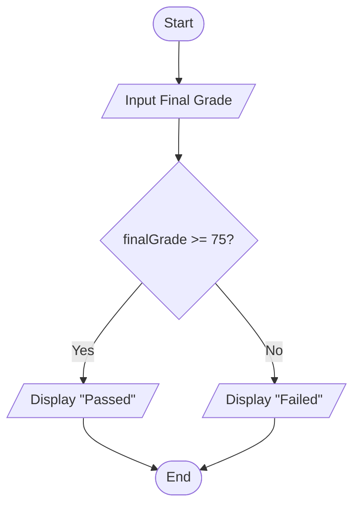

```mermaid
flowchart TD
    A([Start])
    B[/Input Final Grade/]
    C{finalGrade >= 75?}
    D[/Display "Passed"/]
    E[/Display "Failed"/]
    F([End])

    A --> B
    B --> C
    C -- Yes --> D
    C -- No --> E
    D --> F
    E --> F
```