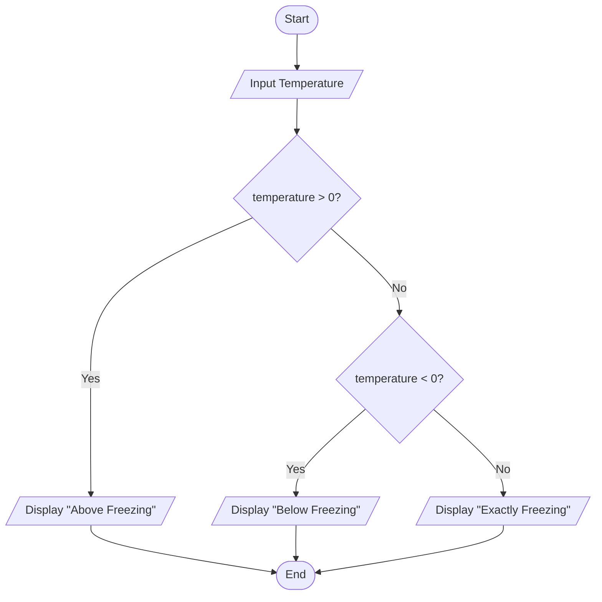

```mermaid
flowchart TD
    A([Start])
    B[/Input Temperature/]
    C{temperature > 0?}
    D[/Display "Above Freezing"/]
    E{temperature < 0?}
    F[/Display "Below Freezing"/]
    G[/Display "Exactly Freezing"/]
    H([End])

    A --> B
    B --> C
    C -- Yes --> D
    C -- No --> E
    E -- Yes --> F
    E -- No --> G
    D --> H
    F --> H
    G --> H
```